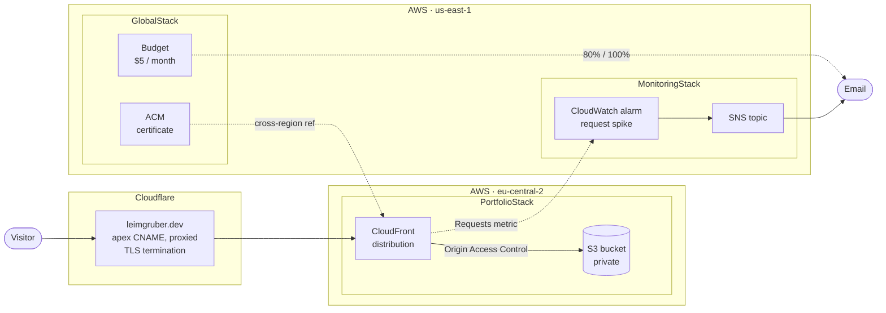
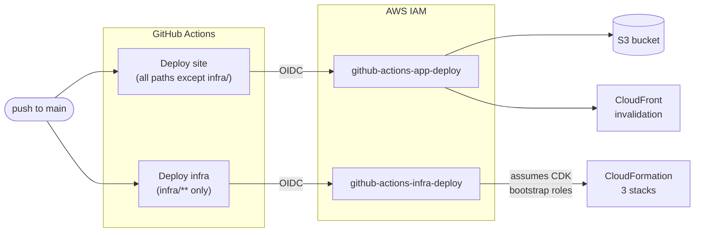

# leimgruber.dev

Personal portfolio site — a single-page CV. Static Vue app in an S3 bucket, served
through CloudFront, with DNS and edge proxying on Cloudflare. Every AWS resource is
defined in CDK and deployed by GitHub Actions over OIDC, with no long-lived AWS
credentials stored anywhere.

**Live:** <https://leimgruber.dev>

## Tech-Stack
| | |
|---|---|
| **Frontend** | Vite · Vue 3 · TypeScript |
| **Infrastructure** | AWS CDK (TypeScript) — 3 stacks across 2 regions |
| **CI/CD** | GitHub Actions + OIDC role assumption |
| **DNS / edge** | Cloudflare |

## Architecture



Requests reach Cloudflare first, which proxies through to CloudFront. CloudFront is the
only thing that can read the bucket — it authenticates via Origin Access Control, so the
bucket itself stays private with all public access blocked.

### Why three stacks across two regions

The site's resources live in **eu-central-2** (Zurich) for data residency. Two things
can't go there, and neither is a preference:

- **ACM certificates for CloudFront** are only accepted from `us-east-1`, regardless of
  where the distribution's other resources live.
- **`AWS::Budgets::Budget`** isn't a valid CloudFormation resource type outside
  `us-east-1` at all.

That forces a `us-east-1` stack. `MonitoringStack` is separate from `GlobalStack` for a
dependency reason rather than a regional one: CloudFront publishes its metrics only to
`us-east-1`, so the alarm must sit there — but it needs the distribution ID from
`PortfolioStack`, which already depends on `GlobalStack`'s certificate. Folding the alarm
into `GlobalStack` would make that cycle.

| Stack | Region | Resources |
|---|---|---|
| `GlobalStack` | us-east-1 | ACM certificate (DNS-validated), monthly cost budget |
| `PortfolioStack` | eu-central-2 | S3 bucket, CloudFront distribution, Origin Access Control |
| `MonitoringStack` | us-east-1 | CloudWatch alarm on CloudFront requests, SNS topic + email subscription |

Values cross region boundaries via CDK's `crossRegionReferences`, which writes them to
SSM Parameter Store and reads them back through a custom resource.

### Notable configuration

- **Cache policy** `CACHING_OPTIMIZED` — query strings, cookies and headers are excluded
  from the cache key, so cache-busting probes can't force origin fetches.
- **Error responses** map 403/404 to `200` with `/index.html`, so a mistyped path renders
  the page instead of an S3 error.
- **Bucket name is pinned** rather than CDK-generated, so the deploy IAM role could be
  scoped to a known ARN before the bucket existed.

## Cloudflare configuration

DNS is managed in Cloudflare, not Route 53 — there's no hosted zone in any stack.

| Type | Name | Target | Proxy |
|---|---|---|---|
| CNAME | `leimgruber.dev` | `<distribution>.cloudfront.net` | Proxied |
| CNAME | `_<hash>` (ACM validation) | `...acm-validations.aws` | **DNS only** |

Two things worth knowing:

- The apex CNAME is legal because of Cloudflare's **CNAME flattening** — a CNAME at a zone
  root isn't normally allowed in DNS.
- The **ACM validation record must stay permanently**. ACM re-checks it to auto-renew the
  certificate; removing it breaks renewal silently, about a year later. It also has to be
  DNS-only, since proxying it would return Cloudflare's IPs instead of the CNAME target.

SSL/TLS encryption mode should be **Full (strict)** so Cloudflare validates CloudFront's
certificate on the origin hop.

## Deployment



Two workflows, split by path so an app change doesn't redeploy infrastructure and vice
versa. Neither stores AWS credentials: both assume a role via GitHub's OIDC provider, and
each role's trust policy is scoped to this repository on `main` specifically.

The two roles are deliberately unequal. `github-actions-app-deploy` can write to the one
bucket and create CloudFront invalidations, nothing more. `github-actions-infra-deploy`
holds no direct permissions at all — only `sts:AssumeRole` on the CDK bootstrap roles,
which carry the actual deployment rights.

IAM roles and the OIDC provider are managed outside CDK
(`infra/scripts/create-github-actions-roles.sh`) so that CI can never modify its own
permissions.

## Local development

```bash
make install     # install dependencies
make dev         # Vite dev server
make build       # type-check and build to dist/
make preview     # build, then serve the production bundle
```

Infrastructure (requires AWS credentials and `BUDGET_ALERT_EMAIL`):

```bash
make infra-install
make infra-synth   BUDGET_ALERT_EMAIL=you@example.com
make infra-diff    BUDGET_ALERT_EMAIL=you@example.com
make infra-deploy  BUDGET_ALERT_EMAIL=you@example.com
```

See [`infra/README.md`](infra/README.md) for first-time setup, including CDK bootstrap and
the manual certificate-validation step.

## Cost

Effectively zero. CloudFront's perpetual free tier (1 TB transfer, 10M requests per month)
covers the traffic by several orders of magnitude, the bucket holds well under a megabyte,
and there's no compute, no NAT gateway, no hosted zone, and no customer-managed KMS key.
Actual billed spend to date is a fraction of a cent, almost all of it S3 request
charges.

Two guardrails watch for that changing:

- A **$5/month budget** emails at 80% and 100% of threshold — though billing data lags up
  to ~24h.
- A **CloudWatch alarm** on CloudFront request count fires within minutes, catching a
  traffic anomaly the same day rather than the next.
